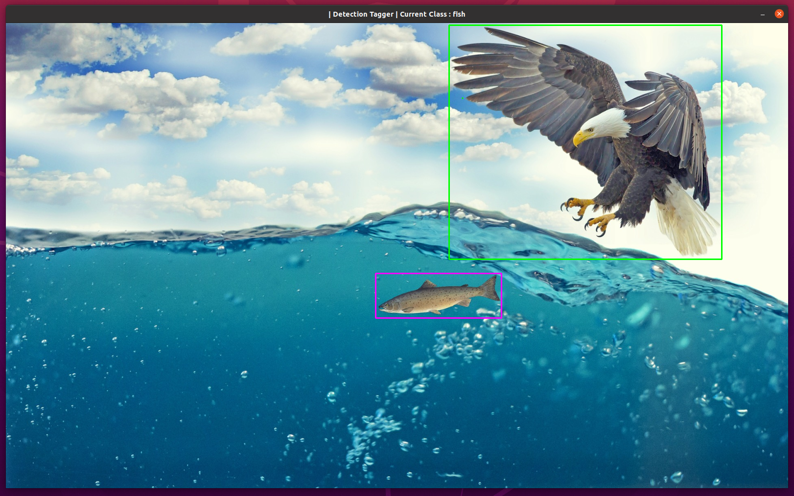

# DetectionTagger

Detection Tagger is a simple tagging tool, especially for a small number of classes.

The bounding boxes are automatically saved (/load) to (/from) json files.

Given an image and class, it enables:
  1. Adding new bounding box by dragging the mouse when pressing the left key.
  2. Deleting bounding boxes by double-click on them.
  3. Deleting all the bounding boxes by pressing c (clear).
  4. Undo by pressing z
  5. Redo by pressing y
  6. Move to the next image by pressing d.
  7. Move to the former image by pressing a.
  8. Move to the next class by pressing SPACE.
  9. When the work on the given image is done, you can press ENTER to never see this image again. Then, you automatically will forwarded to the next image.
  10. Quit by pressing q.

The data structure of operations that enables the redo & undo doesn't saved due to storage optimization and hence this tool enables redo & undo only on the new operations since the last openning of the tool.
